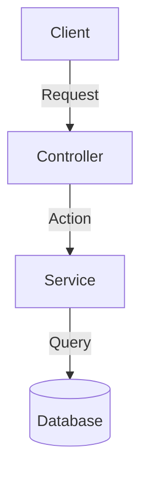

# Spec: [FEATURE_SLUG]

**Status:** `backlog` | `in-progress` | `review` | `done` | `blocked`
**Slug:** `[project-slug]::[feature-slug]`
**Sprint:** [Sprint Name/Number]
**Created:** YYYY-MM-DD
**Last updated:** YYYY-MM-DD

---

## Objective / Objetivo

- [Clear, single-sentence value statement]

## Technical Context / Contexto Técnico

- [Core problem statement, stack context, and architectural impact]

## Mermaid Data Flow / Arquitetura (Mermaid Flowchart)

## Out of Scope / Fora do Escopo

- [Explicit exclusions to prevent scope creep]

## Technical Decisions / Decisões Técnicas

- [Decision] — [Discarded alternatives] — [Why this one]

## Dependencies / Dependências

- **Depends on / Depende de:** [spec-slug or "none"]
- **Blocks / Bloqueia:** [spec-slug or "nothing"]

## Relevant Files / Arquivos Relevantes

- [ ] `file:///path/to/file`

## Acceptance Criteria / Critérios de Aceite

- [ ] [Verifiable condition 1]
- [ ] [Verifiable condition 2]

---

## TDD Implementation Checklist / Ciclo TDD

- [ ] **Red:** Write automated test for [Requirement] and verify it fails.
- [ ] **Green:** Implement minimum code to make test pass.
- [ ] **Refactor:** Clean and optimize implementation without breaking tests.

## Tasks / Tarefas

- [ ] [Task 1 / Tarefa 1]
- [ ] [Task 2 / Tarefa 2]

---

## Verification Plan / Plano de Verificação

### Automated Tests / Testes Automatizados
- [Command to run tests, e.g. `npm test`]

### Manual Verification / Verificação Manual
- [Step-by-step verification steps]

---

## How to Resume / Como Retomar este Trabalho

**Current State / Estado Atual:** [brief summary of completed tasks]
**Next Step / Próximo Passo:** [exact next action to execute when resuming]
**Blockers / Bloqueadores:** [none / list blockers]

---

## Implementation Notes / Notas de Implementação

- [Gotchas, minor decisions, references accumulated during coding]
